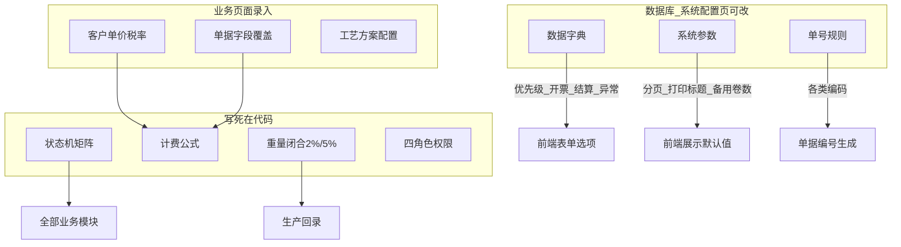

# 卷筒纸加工 MES — 系统能力清单

**系统名称：** 卷筒纸加工管理系统 V4.1  
**技术栈：** Spring Boot 3.3 + Java 21 + MyBatis-Plus + MySQL 8.0 | React 18 + Vite + Ant Design 5  
**业务闭环：** 建档 → 建单 → 打印下发 → 生产回录 → 出库 → 结算收款 → 报表

---

## 0. 全局约束（跨模块）

### 能做什么

- 单租户本地部署：后端 JAR（8081）+ 前端静态资源 + MySQL
- Bearer Token 认证（12 小时会话），除登录外全部 `/api/**` 需鉴权
- 全表 UUID 主键、软删除（`is_deleted`）、乐观锁（`version`）
- 关键写操作行锁（`SELECT … FOR UPDATE`）+ 操作日志 + 部分字段级审计
- 业务快照 JSON（打印/回录/出库/结算）固化历史数据

### 不能做什么

- 无多租户、无 SSO/OAuth、无 LDAP
- 无 Docker/K8s/CI 部署脚本（`application-dev.yml` 需本地自建，含数据库密码）
- 无 Flyway/Liquibase 自动迁移；生产部署使用 `deploy/apply-paper-mes-migrations.example.sh` 按 `sql/V*.sql` 顺序执行并记录 checksum，启动时 Bootstrap 仍会补表/种子兜底
- 数据库无外键约束，关联完整性靠应用层
- 上传文件不再公开裸露访问；前端通过 `/api/files/**` 鉴权读取，旧 `/files/**` 路径仅作兼容且同样要求登录及 `order:view` 权限
- 无 Redis/消息队列；并发靠 MySQL 锁
- 系统配置页声明：**"第一阶段只影响配置维护与展示，不自动改写已保存业务单据"**（`frontend/src/pages/systemConfig/SystemConfigPage.tsx`）

### 写死 vs 可配置

| 类别 | 写死在代码/配置文件 | 可通过前端页面改 |
|------|---------------------|------------------|
| 服务端口、上传目录、文件大小上限 | `src/main/resources/application.yml` | 否 |
| 会话时长 12h | `AuthServiceImpl` | 否 |
| 角色种类（4 种）及权限矩阵 | `Permissions.java` | 否（只能给用户分配固定角色） |
| 状态机流转矩阵 | `OrderStatus` 等 | 否 |
| 计费公式 | `FeeCalculator` | 否 |
| 重量闭合阈值 2%/5% | `WeightCheckCalculator` | 否（见加工单模块说明） |
| 数据字典、系统参数、单号规则 | Bootstrap 种子 | 是（系统配置页） |
| 客户单价/税率/结算方式 | — | 是（客户档案 + 单据可覆盖） |

---

## 1. 认证与用户权限

### 能做什么

- 用户名密码登录 → 返回 Token
- `/api/auth/me` 获取当前用户与有效权限列表
- 登出吊销会话
- 4 种预置角色：`admin` / `operator` / `finance` / `warehouse`
- 用户 CRUD、启用/禁用、密码重置（8–32 位，必须包含字母和数字）
- 路由级权限守卫 + 侧边栏菜单按权限过滤
- 空库自动创建初始账号；生产环境必须配置强初始密码，不再使用固定默认密码。

### 不能做什么

- 不能自定义角色或逐权限勾选（仅 4 角色固定映射）
- 不能自助修改姓名、角色等个人资料（个人中心仅支持查看身份与修改本人密码）
- 不能禁用当前登录用户自身
- 用户管理 API 额外要求 `role_code=admin`（不仅靠 `user:manage` 注解）
- 前端多数业务按钮**不做**细粒度权限隐藏（仅路由拦截）；越权操作依赖后端拒绝
- 无 MFA
- 无按数据范围（客户/仓库）隔离

### 写死 vs 可配置

| 写死 | 页面可改 |
|------|----------|
| 4 角色及 `Permissions.resolve()` 权限映射 | 用户姓名、角色（四选一）、状态、密码 |
| 会话 12h、Token 格式 | — |
| 权限常量 14 项 + `*` | — |

**角色权限对照（写死）：**

- **admin**：全部权限
- **operator**：基础查看、加工单查看/创建/回录、报表
- **finance**：基础查看、加工单/出库查看、结算查看/办理/收款、报表
- **warehouse**：基础查看、加工单/出库查看、出库办理、报表

---

## 2. 基础档案

### 2.1 客户（`sys_customer`）

**能做什么：** 分页列表、详情、新建/编辑/软删；维护锯纸单价、复卷单价、默认结算方式（次结/月结）、开票方式、税率、价格类型；编码可留空自动生成（单号规则 `customer` / 前缀 KH）

**不能做什么：** 已被业务单据引用的客户不能随意破坏关联（删除为软删）；无客户分级/信用额度

**写死 vs 可配置：** 新建客户默认结算方式=月结(2)、默认不开票(2) 写死在 `CustomerServiceImpl`；结算/开票选项标签来自数据字典（页面可维护）

### 2.2 纸张（`sys_paper`）

**能做什么：** CRUD；名称、克重、纸型（自由文本）；编码自动生成（前缀 ZZ）

**不能做什么：** 纸张档案与加工单无强制引用校验展示层限制；纸型非枚举字典

**写死 vs 可配置：** 纸型为自由文本；编码规则可在系统配置-单号规则中改

### 2.3 机台（`sys_machine`）

**能做什么：** CRUD；名称、编码（前缀 JT）、类型、启用/停用

**不能做什么：** 机台类型仅 3 种：锯纸/复卷/通用（前后端均写死选项）

**写死 vs 可配置：** 类型枚举写死在 `frontend/src/pages/machine/MachineFormPage.tsx`；状态 1 启用 / 2 停用写死

### 2.4 仓库（`sys_warehouse`）

**能做什么：** CRUD；编码（前缀 CKD）、名称、状态

**不能做什么：** 无库位/库区层级；无库存数量独立台账（库存状态挂在成品卷上）

**写死 vs 可配置：** 编码规则可改；其余字段业务录入

---

## 3. 加工单（核心 MES）

### 能做什么

**创建流程（5 步向导）：**

1. 基础信息（客户、仓库、日期、优先级、结算/开票覆盖）
2. 原纸录入（手工 + CSV/Excel 导入预览）
3. 加工方式：标准加工(1) / 现场定尺(2) / 不加工直发(3)
4. 锯纸/复卷方案配置（含 5 种复卷模式、多源分摊 mode=5）
5. 预览并提交草稿 → 生成正式加工单 + 预生成成品卷号 + 备用卷号

**正式单生命周期：**

- 状态：草稿(0) → 待下发(1) → 加工中(2) → 待回录(3) → 已完成(4) → 已结算(5)
- 打印下发（首次：待下发→加工中，写入 `snap_print`）
- 重打（仅加工中，需原因）
- 生产回录：原纸复称、成品实录入库、损耗/报废/修边、异常标记、三级重量闭合
- 超差 BLOCK（>5%）需管理员授权 + 放行原因
- 直发模式自动完成相关卷状态
- 成品卷号管理：批量生成/追加/作废（仅未使用的预生成号）
- 工序 CRUD（待下发状态）：新增/修改/删除追加工序；每卷唯一主工序
- 费用计算：锯纸=刀数×单价；复卷=吨位×单价；税额按开票/税率
- 状态回退：待回录→待下发；已完成→待回录（有结算/出库等 guard）
- 快照 diff 对比
- 损伤图片上传（jpg/jpeg/png/webp/gif，单文件 ≤10MB），详情页通过受保护文件接口展示

### 不能做什么

- 已结算单不可回退、不可重算费用
- 已有成品出库的加工单不可回退
- 打印后（状态≥加工中）不可增删工序
- 主工序不可删除
- 不能手动将成品状态直接设为"已入库/已出库"（须走回录/出库流程）
- 草稿提交：至少 1 卷原纸；每卷需完整工艺配置（直发/多源覆盖卷除外）
- 复卷模式仅 1–5；模式 >1 时目标直径、纸芯直径必填
- 多源分摊比例须合计 100%
- 成品卷批量操作单次上限 **500**
- 无独立"全链路溯源查询"页面/API（Phase 5 计划项，未实现）；溯源信息仅嵌入出库明细
- 无移动端专用界面
- 优先级字典仅种子"普通/加急"，前端常量含"特急(3)"但字典未种子

### 写死 vs 可配置

| 写死在代码 | 前端/系统配置可改 |
|------------|-------------------|
| 加工单/原纸/成品状态机（`OrderStatus`、`RollStatus`、`FinishStatus`） | — |
| 加工方式 1/2/3、工序类型 1锯/2复、复卷模式 1–5 | — |
| 重量闭合：PASS≤2%、WARN 2–5%、BLOCK>5%（`WeightCheckCalculator`） | `process.weightTolerancePercent` 存在于系统参数但**前后端均未用于闭合计算** |
| 计费公式与取整规则（`FeeCalculator`） | 单价来自客户档案或单据字段（页面录入） |
| 状态/模式/工序标签与颜色（`frontend/src/constants/processOrder.ts`） | 优先级/开票/结算/异常类型优先读字典 |
| 默认备用卷号数量逻辑在后端 DTO 校验 | 新建单默认备用数 ← `process.spareRollNoCount` |
| 加工单号规则前缀 JG | 单号规则页可改 prefix/pattern/serial |
| 打印标题 fallback "车间加工单" | ← `print.processOrderTitle` |
| 成品卷号格式：1 字母 + 6 数字 | 单号规则 `finish_roll` 可改前缀，格式约束在代码 |

---

## 4. 成品卷管理

### 能做什么

- 全局唯一成品卷号（`sys_roll_no_sequence` 原子序号）
- 提交加工单时预生成卷号 + 备用卷号
- 批量生成、追加、批量作废
- 卷号可用性检查
- 状态随回录/出库自动流转

### 不能做什么

- 已绑定实物的卷号（`roll_no_status=2`）**不可作废**（永久保留溯源）
- 作废仅针对预生成未使用号（status=1）
- 批量作废全成功或全失败（原子性）
- 卷号冲突最多重试 5 次

### 写死 vs 可配置

- 号段规则、前缀：单号规则页可改
- 500 条批量上限、字母+6 位格式：写死

---

## 5. 出库管理

### 能做什么

- 出库单列表（全部/待出库/已出库队列）
- 按客户选取**已入库**成品创建出库单
- 出库确认（成品→已出库，写入 `snap_delivery`）
- 待出库状态可追加/移除明细
- 出库回退（已出库→待处理，写原因）
- 次结客户未结清时**拦截出库**（可 `forceRelease` 强制放行并记录）
- Excel 导出、打印
- 出库明细含原纸/工序溯源摘要（后端组装，非独立查询模块）
- 批量确认签收（列表页）

### 不能做什么

- 不能出库非"已入库(2)"状态的成品
- 同一成品不能同时出现在多张待出库单
- 出库重量须 >0 且 ≤ 件重
- 出库明细须同一客户
- 已关联结算的出库单不可回退
- 非待出库状态不可改明细
- 无"按订单整单出库"的一键模式（须逐卷勾选）
- Phase 5 计划的"分批出库专用流程"未作为独立模块存在（但支持一张出库单分多次创建/追加）

### 写死 vs 可配置

- 出库状态码、次结拦截逻辑（`settle_type=1`）写死
- 出库单号前缀 CK：单号规则可改
- 公司名称展示：`print.companyName` 可改

---

## 6. 结算与收款

### 能做什么

- 结算单列表（队列 Tab）
- **三种创建方式（后端均已实现）：**
  - 按单：`POST /api/settle-orders/by-order`
  - 勾选多单：`POST /api/settle-orders/by-orders`（1 单→按单类型，≥2 单→月结类型）
  - 按月：`POST /api/settle-orders/by-month`（按客户+期间自动捞取已完成单）
- 结算候选：仅**已完成(4)**且未结算的加工单
- 结算详情：分组账单、打印、Excel 导出
- 登记收款（现金/转账/微信/支付宝）
- 取消收款记录（需原因，≤255 字）
- 作废结算单（无有效收款时），关联加工单回退至已完成
- 一张加工单仅允许一条有效结算（DB 唯一约束 + E004）
- 收款不能超额；已结清不可再收

### 不能做什么

- 未完成费用计算的加工单（金额≤0）不可结算
- 有活跃收款的结算单不可作废
- **前端未接入"按月结算"专用入口**：`SettleByMonthDrawer.tsx` 已实现但未挂载到任何页面；当前仅 `SettleCreatePage.tsx` 勾选模式
- 无自动月结定时任务（须人工创建）
- 无发票开具/税控对接（仅记录是否开票与税率）

### 写死 vs 可配置

- 结算类型 1按单/2按月、支付方式枚举：写死
- 开票方式：字典可维护
- 结算单号前缀 JS：单号规则可改
- 税额计算规则：写死在 `FeeCalculator.tax()`

---

## 7. 报表与仪表盘

### 能做什么

**仪表盘（`/dashboard`）：** KPI、状态队列、待办、月/年趋势、客户/机台排名、近期加工单、活动时间线

**统计报表（`/reports`）：**

- 筛选：日期、客户、机台、纸张、加工方式等
- 维度切换：month / customer / paper / process / machine / invoice / settleType / status
- 概览指标、趋势图、柱状列表、明细表
- Excel 导出

**专项 API（后端）：** `/api/reports/monthly`、`/customer`、`/loss`、`/machine`

### 不能做什么

- 统计维度集合固定 8 种（`ReportServiceImpl.DIMENSIONS`），不可扩展
- 无自定义报表/拖拽 BI
- 无实时推送/订阅
- 报表数据依赖业务表实时聚合，无独立数仓

### 写死 vs 可配置

- 维度列表、默认日期范围：写死
- 分页条数：`ui.defaultPageSize` 可改
- 开票/结算筛选选项：字典可改

---

## 8. 系统配置

### 能做什么（需 `user:manage`）

| Tab | 能力 |
|-----|------|
| 数据字典 | CRUD；按 dictType 分组；内置项不可删、可禁用/改值 |
| 系统参数 | CRUD；支持 string/number/boolean；内置项不可删 |
| 单号规则 | **仅编辑**（不可新建 bizType）；预览下一号 |

**已种子字典类型：** settle_type、invoice_type、priority、fee_type、abnormal_type

**已种子系统参数：**

| config_key | 默认值 | 实际生效范围 |
|------------|--------|--------------|
| `process.spareRollNoCount` | 0 | 前端新建加工单默认值 |
| `process.weightTolerancePercent` | 3 | **仅存储/展示，未驱动闭合逻辑** |
| `print.processOrderTitle` | 车间加工单 | 前端打印预览标题 |
| `print.companyName` | 纸品加工 MES | 打印/出库/结算展示 |
| `ui.defaultPageSize` | 20 | 各列表分页默认值 |

**运行时读取 API：** `/api/system/runtime/dicts`、`/configs`（任意登录用户可读）

### 不能做什么

- 不能新增单号规则 bizType（8 种固定）
- 内置字典/参数不可删除
- 修改配置**不会回溯**已存业务单据字段
- 不能通过 UI 修改：状态机、角色、计费公式、重量阈值、上传限制
- 不能配置主题/Logo（Ant Design 主题写死在 `frontend/src/main.tsx`）

### 写死 vs 可配置

- 单号规则 bizType 映射、pattern/resetCycle 选项列表：UI 写死选项
- 字典/参数/规则的值：页面可 CRUD（内置项限删）

---

## 9. 操作日志

### 能做什么

- 分页查询操作日志（`system:audit`，admin 专属权限）
- 按业务类型、动作、时间、操作人筛选
- 详情抽屉、跳转关联业务单据
- 后端 AOP 字段级变更记录（部分实体）

### 不能做什么

- 只读，不可删除/篡改
- 非 admin 角色无 `system:audit`（其他角色看不到菜单）
- 日志保留策略无 UI 配置（无限增长）

### 写死 vs 可配置

- 业务类型/动作类型标签映射写死在 `frontend/src/pages/operationLog/OperationLogPage.tsx`
- 无页面可配置项

---

## 10. 数据库与数据模型

### 能做什么

- 23 张表覆盖：档案 4 + 加工核心 7 + 出库 2 + 结算 3 + 系统 7
- JSON 快照列：`snap_print`、`snap_finish`、`snap_bill`、`snap_delivery`
- 唯一约束：成品卷号全局唯一；每卷一个主工序；每单一条有效结算
- 软删除 + 乐观锁全表覆盖

### 不能做什么

- 无外键；级联删除靠应用
- 无数据库级 ENUM；状态均为 tinyint/int
- 无历史版本表（仅 snapshot JSON）
- 迁移需在发布前运行脚本化执行器处理 `sql/V*.sql`，执行历史记录在 `sys_schema_migration`

### 写死 vs 可配置

- 表结构仅能通过 SQL 变更，无 UI
- 单号/字典/参数见系统配置模块

---

## 11. 部署与运行环境

### 能做什么

- 本地/内网部署：Java 21 + MySQL 8.0 + Node 构建前端
- Vite 开发代理：`VITE_API_PROXY_TARGET` → 后端
- 文件本地存储 `./upload`
- 提供 systemd、Nginx、日志切割、数据库/上传文件备份、恢复演练脚本样例
- 提供仅限本机访问的 Spring Boot 健康接口，以及 systemd 定时巡检和 Webhook 状态变化告警模板
- 提供慢查询/索引排查脚本样例：读取生产环境数据库配置，只执行 `SHOW INDEX`、`information_schema` 和 `EXPLAIN FORMAT=JSON SELECT`
- Nginx 样例包含 `/api/auth/login` 站点级限流、正式 CSP、`/files/**` 后端鉴权代理

### 不能做什么

- 无 Docker 镜像、无 compose、无 CI/CD 自动发布
- 无自动申请 HTTPS 证书脚本（证书仍需按服务器实际环境配置）
- 监控和异地备份任务不会自动写入服务器 systemd/cron；需按部署指南安装模板、配置告警地址并完成故障与恢复演练
- 不自动新增索引；索引变更需根据慢查询日志或 `EXPLAIN` 结果另写迁移脚本
- `application-dev.yml` 不在仓库（需自行配置数据源）

### 写死 vs 可配置

- 端口 8081、上传 10MB/50MB、时区 GMT+8：配置文件
- 仅环境变量 `VITE_API_PROXY_TARGET` 影响前端 dev 代理

---

## 12. 文档 vs 代码差异（客观记录）

| 文档描述 | 代码现状 |
|----------|----------|
| V4.1 提及 Redisson 分布式锁 | 实际用 MySQL 行锁 |
| `process.weightTolerancePercent` 驱动回录阈值 | 后端硬编码 2%/5%，参数未读取 |
| Phase 5 全链路溯源查询 | 未实现独立模块；出库明细含部分溯源 |
| Phase 5 追加工序 API | **已实现**（`ProcessOrderController` `/steps`） |
| 项目完成度报告称出库/结算页缺失 | 前端页面已存在 |
| 按月结算 UI | Drawer 组件存在但未挂载导航 |

---

## 配置生效关系总览

---

## 附录 A：加工单 / 回录 / 复卷 API 级展开

以下按 `/api/process-orders` 与 `/api/finish-rolls` 路由列出已实现端点、所需权限及关键约束。

### A.1 草稿创建（5 步向导）

| 方法 | 路径 | 权限 | 说明 |
|------|------|------|------|
| GET | `/drafts` | order:view | 草稿列表 |
| GET | `/{orderUuid}/draft` | order:view | 草稿详情（含各步进度） |
| POST | `/drafts` | order:create | 创建草稿，返回 orderUuid |
| PUT | `/{orderUuid}/base-info` | order:create | 保存基础信息 |
| PUT | `/{orderUuid}/draft-progress` | order:create | 保存当前向导步骤号 |
| PUT | `/{orderUuid}/original-rolls` | order:create | 全量替换原纸列表 |
| POST | `/{orderUuid}/original-rolls/import-preview` | order:create | CSV/Excel 导入预览（multipart） |
| POST | `/{orderUuid}/rolls/plan-preview` | order:create | 单卷工艺方案预览 |
| PUT | `/{orderUuid}/rolls/{rollUuid}/process-plan` | order:create | 保存单卷工艺方案 |
| PUT | `/{orderUuid}/rolls/process-plan/batch` | order:create | 批量保存工艺方案 |
| PUT | `/{orderUuid}/rolls/{rollUuid}/process-config` | order:create | 保存加工配置草稿 JSON |
| POST | `/{orderUuid}/submit` | order:create | 提交草稿 → 正式单 + 生成卷号 |

**提交约束：** 至少 1 卷原纸；每卷需完整 process-config（直发卷、多源覆盖卷除外）；生成正式加工单号与成品卷号。

### A.2 正式加工单生命周期

| 方法 | 路径 | 权限 | 说明 |
|------|------|------|------|
| GET | `/` | order:view | 分页列表 |
| GET | `/{uuid}` | order:view | 详情（含原纸、工序、成品树） |
| POST | `/` | order:create | 快速创建（非向导） |
| POST | `/{orderUuid}/rolls` | order:create | 追加原纸 |
| PUT | `/rolls/{rollUuid}` | order:create | 修改原纸 |
| DELETE | `/rolls/{rollUuid}` | order:create | 删除原纸 |
| PUT | `/{uuid}/status` | order:manage | 加工单状态变更（受状态机约束） |
| PUT | `/rolls/{rollUuid}/status` | order:manage | 原纸卷状态变更 |
| POST | `/{uuid}/print` | order:manage | 打印下发 / 重打 |
| POST | `/{uuid}/calc-fee` | order:manage | 重算加工费 |
| GET | `/{uuid}/snapshot-diff` | order:view | 打印快照 vs 回录快照差异 |
| POST | `/rolls/{rollUuid}/damage-images` | order:create | 上传损伤图片（multipart） |

**状态机（加工单）：** 0→1→2→3→4→5；回退 3→1、4→3；5 为终态。

### A.3 生产回录

| 方法 | 路径 | 权限 | 说明 |
|------|------|------|------|
| POST | `/{uuid}/back-record` | order:back-record | 提交整单回录 |

**请求体要点（`BackRecordDTO`）：**

- 每卷原纸：`actualWeight`（复称，>0）、损耗/报废/修边、异常类型
- 每卷成品：实重、尺寸、质量标记、是否边角余料
- 闭合超 BLOCK（偏差率 >5%）：须 `overToleranceAuthorized=true` + `releaseReason`
- 闭合 WARN（2–5%）：须填写原因

**服务端行为：**

- 校验三级重量闭合（`WeightCheckCalculator`，阈值写死 2%/5%）
- 直发卷自动标记完成
- 作废未使用的备用卷号
- 成品状态：待入库 → 已入库
- 加工单：待回录 → 已完成
- 写入 `snap_finish` 快照

**不能通过回录做的：** 不能跳过闭合直接完成；不能对已结算单回录。

### A.4 复卷方案与预览

| 方法 | 路径 | 权限 | 说明 |
|------|------|------|------|
| POST | `/{orderUuid}/rolls/{rollUuid}/rewind-plan/preview` | order:create | 复卷方案预览（正式单阶段） |
| POST | `/{orderUuid}/rolls/plan-preview` | order:create | 草稿阶段方案预览 |
| POST | `/{orderUuid}/rolls/{rollUuid}/finish-config` | order:create | 保存成品配置 |

**复卷模式（写死 1–5）：**

| 模式 | 含义 |
|------|------|
| 1 | 按宽度分切 |
| 2 | 按目标直径 |
| 3 | 按层数 |
| 4 | 合并复卷 |
| 5 | 多源分摊（area_ratio 合计须 100%） |

**模式 >1 时：** `targetDiameter`、`finishCoreDiameter` 必填。重量分摊公式见 `docs/复卷重量分摊计算规格书.md`。

### A.5 工序 CRUD（Phase 5.1）

| 方法 | 路径 | 权限 | 约束 |
|------|------|------|------|
| POST | `/{orderUuid}/steps` | order:manage | 新增工序 |
| PUT | `/steps/{stepUuid}` | order:manage | 修改工序（仅待下发） |
| DELETE | `/steps/{stepUuid}` | order:manage | 删除工序（仅待下发，主工序不可删） |

**工序类型（写死）：** 1=锯纸，2=复卷。每原纸卷仅允许 1 个主工序（`is_main_step=1`）。

### A.6 成品卷号 API（`/api/finish-rolls`）

| 方法 | 路径 | 权限 | 说明 |
|------|------|------|------|
| PUT | `/{uuid}/status` | order:manage | 成品状态变更（受限，不可直接入库/出库） |
| POST | `/orders/{orderUuid}/batch` | order:manage | 批量生成正式卷号（≤500） |
| POST | `/orders/{orderUuid}/spare` | order:manage | 追加备用卷号 |
| DELETE | `/{uuid}/roll-no` | order:manage | 作废单个预生成卷号 |
| POST | `/batch-void` | order:manage | 批量作废（全成功或全失败） |
| GET | `/check?rollNo=` | order:view | 卷号全局查重 |

---

*本清单为只读分析，不含改进建议。生成日期：2026-07-01。*
